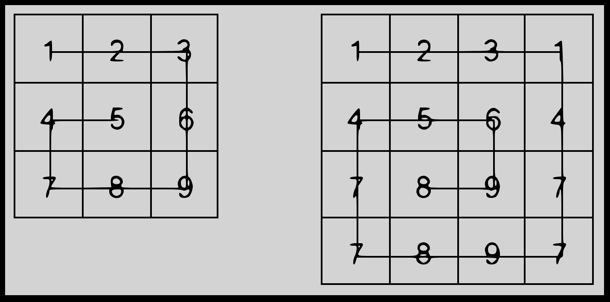

<h1>Snail <sup><sup>4 Kyu</sup></sup></h1>

<sup>
  <a href="https://www.codewars.com/kata/521c2db8ddc89b9b7a0000c1">
    <strong>LINK TO THE KATA</strong>
  </a> - <code>ARRAYS</code> <code>ALGORITHMS</code>
</sup>

## Description

**Snail Sort**

Given an `n x n` array, return the array elements arranged from outermost elements to the middle element, traveling clockwise.

```
array = [[1,2,3],
         [4,5,6],
         [7,8,9]]
snail(array) #=> [1,2,3,6,9,8,7,4,5]
```

For better understanding, please follow the numbers of the next array consecutively:

```
array = [[1,2,3],
         [8,9,4],
         [7,6,5]]
snail(array) #=> [1,2,3,4,5,6,7,8,9]
```

This image will illustrate things more clearly:



NOTE: The idea is not sort the elements from the lowest value to the highest; the idea is to traverse the 2-d array in a clockwise snailshell pattern.

NOTE 2: The 0x0 (empty matrix) is represented as en empty array inside an array [[]].

## Solutions

```javascript
const snail = array => {
  const size = array.length

  if (size == 0) return []

  if (size == 1) return array[0]

  const top = array[0].slice(0, -1)
  const right = array.slice(0, -1).map(a => a[size - 1])
  const bottom = array[size - 1].slice(1).reverse()
  const left = array
    .slice(1)
    .map(a => a[0])
    .reverse()
  const inner = array.slice(1, -1).map(a => a.slice(1, -1))

  return [].concat(top, right, bottom, left, snail(inner))
}
```

```javascript
const snail = array => {
  const result = []

  while (array.length > 0) {
    // Add the first row to result
    result.push(...array.shift())

    // Add the last element of each remaining row
    for (let i = 0; i < array.length; i++) {
      result.push(array[i].pop())
    }

    // Add the last row in reverse order
    array.length > 0 && result.push(...array.pop().reverse())

    // Add the first element of each remaining row, in reverse order
    for (let i = array.length - 1; i >= 0; i--) {
      result.push(array[i].shift())
    }
  }

  return result
}
```
