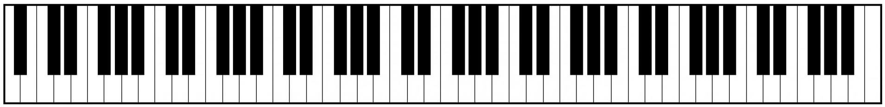

<h1>Piano Kata, Part 1 <sup><sup>6 Kyu</sup></sup></h1>

<sup>
  <a href="https://www.codewars.com/kata/589273272fab865136000108">
    <strong>LINK TO THE KATA</strong>
  </a> - <code>FUNDAMENTALS</code>
</sup>

## Description

"A _piano_ in the home meant something." - _Fried Green Tomatoes at the Whistle Stop Cafe_

You've just realized a childhood dream by getting a beautiful and beautiful-sounding upright piano from a friend who was leaving the country. You immediately started doing things like playing "[Heart and Soul](<https://en.wikipedia.org/wiki/Heart_and_Soul_(Frank_Loesser_and_Hoagy_Carmichael_song)#Musical_format>)" over and over again, using one finger to pick out any melody that came into your head, requesting some sheet music books from the library, signing up for some MOOCs like [Developing Your Musicianship](https://www.coursera.org/learn/develop-your-musicianship), and wondering if you will think of any good ideas for writing piano-related katas and apps.

Now you're doing an exercise where you play the very first (leftmost, lowest in pitch) key on the 88-key keyboard, which (as shown below) is white, with the little finger on your left hand, then the second key, which is black, with the ring finger on your left hand, then the third key, which is white, with the middle finger on your left hand, then the fourth key, also white, with your left index finger, and then the fifth key, which is black, with your left thumb. Then you play the sixth key, which is white, with your right thumb, and continue on playing the seventh, eighth, ninth, and tenth keys with the other four fingers of your right hand. Then for the eleventh key you go back to your left little finger, and so on. Once you get to the rightmost/highest, 88th, key, you start all over again with your left little finger on the first key. Your thought is that this will help you to learn to move smoothly and with uniform pressure on the keys from each finger to the next and back and forth between hands.



You're not saying the names of the notes while you're doing this, but instead just counting each key press out loud (not starting again at 1 after 88, but continuing on to 89 and so forth) to try to keep a steady rhythm going and to see how far you can get before messing up. You move gracefully and with flourishes, and between screwups you hear, see, and feel that you are part of some great repeating progression between low and high notes and black and white keys.

**Your Function**

The function you are going to write is not actually going to help you with your piano playing, but just explore one of the patterns you're experiencing: Given the number you stopped on, was it on a black key or a white key? For example, in the description of your piano exercise above, if you stopped at 5, your left thumb would be on the fifth key of the piano, which is black. Or if you stopped at 92, you would have gone all the way from keys 1 to 88 and then wrapped around, so that you would be on the fourth key, which is white.

Your function will receive an integer between 1 and 10000 (maybe you think that in principle it would be cool to count up to, say, a billion, but considering how many years it would take it is just not possible) and return the string "black" or "white" -- here are a few more examples:

```
1     "white"
12    "black"
42    "white"
100   "black"
2017  "white"
```

Have fun!

## Solution

```javascript
const NUMBER_PIANO_KEYS = 88

const W = 'white'
const B = 'black'

const PIANO_KEYS = [W, B, W, W, B, W, B, W, W, B, W, B]

const createPiano = numberOfKeys => {
  const result = []
  for (let i = 0; i < numberOfKeys; i++) {
    result.push(PIANO_KEYS[i % PIANO_KEYS.length])
  }
  return result
}

const blackOrWhiteKey = keyPressCount => {
  const piano = createPiano(NUMBER_PIANO_KEYS)
  const keyIndex = keyPressCount - 1

  return piano[keyIndex % NUMBER_PIANO_KEYS]
}
```
