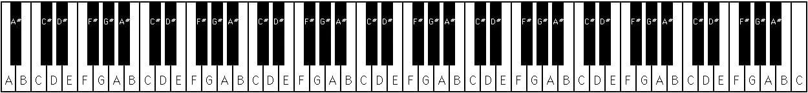

<h1>Piano Kata, Part 2 <sup><sup>6 Kyu</sup></sup></h1>

<sup>
  <a href="https://www.codewars.com/kata/589631d24a7323d18d00016f">
    <strong>LINK TO THE KATA</strong>
  </a> - <code>FUNDAMENTALS</code>
</sup>

## Description

You're continuing to enjoy your new piano, as described in [Piano Kata, Part 1](./piano-kata-part-1.md). You're also continuing the exercise where you start on the very first (leftmost, lowest in pitch) key on the 88-key keyboard, which (as shown below) is the note A, with the little finger on your left hand, then the second key, which is the black key A# ("A sharp"), with your left ring finger, then the third key, B, with your left middle finger, then the fourth key, C, with your left index finger, and then the fifth key, C#, with your left thumb. Then you play the sixth key, D, with your right thumb, and continue on playing the seventh, eighth, ninth, and tenth keys with the other four fingers of your right hand. Then for the eleventh key you go back to your left little finger, and so on. Once you get to the rightmost/highest, 88th, key, C, you start all over again with your left little finger on the first key.



This time, in addition to counting each key press out loud (not starting again at 1 after 88, but continuing on to 89 and so forth) to try to keep a steady rhythm going and to see how far you can get before messing up, you're also saying the name of each note. You wonder whether this may help you develop perfect pitch in addition to learning to just _know_ which note is which, and -- as in [Piano Kata, Part 1](./piano-kata-part-1.md) -- helping you to learn to move smoothly and with uniform pressure on the keys from each finger to the next and back and forth between hands.

The function you are going to write will explore one of the patterns you're experiencing in your practice: Given the number you stopped on, which note was it? For example, in the description of your piano exercise above, if you stopped at 5, your left thumb would be on the fifth key of the piano, which is C#. Or if you stopped at 92, you would have gone all the way from keys 1 to 88 and then wrapped around, so that you would be on the fourth key, which is C.

Your function will receive an integer between 1 and 10000 (maybe you think that in principle it would be cool to count up to, say, a billion, but considering how many years it would take it is just not possible) and return one of the strings "A", "A#", "B", "C", "C#", "D", "D#", "E", "F", "F#", "G", or "G#" indicating which note you stopped on -- here are a few more examples:

```
1     "A"
12    "G#"
42    "D"
100   "G#"
2017  "F"
```

Have fun!

## Solution

```javascript
const NUMBER_PIANO_KEYS = 88

const CHROMATIC_SCALE = [
  'A',
  'A#',
  'B',
  'C',
  'C#',
  'D',
  'D#',
  'E',
  'F',
  'F#',
  'G',
  'G#',
]

const createPiano = numberOfKeys => {
  const result = []
  for (let i = 0; i < numberOfKeys; i++) {
    result.push(CHROMATIC_SCALE[i % CHROMATIC_SCALE.length])
  }
  return result
}

const whichNote = keyPressCount => {
  const piano = createPiano(NUMBER_PIANO_KEYS)
  const keyIndex = keyPressCount - 1

  return piano[keyIndex % NUMBER_PIANO_KEYS]
}
```
