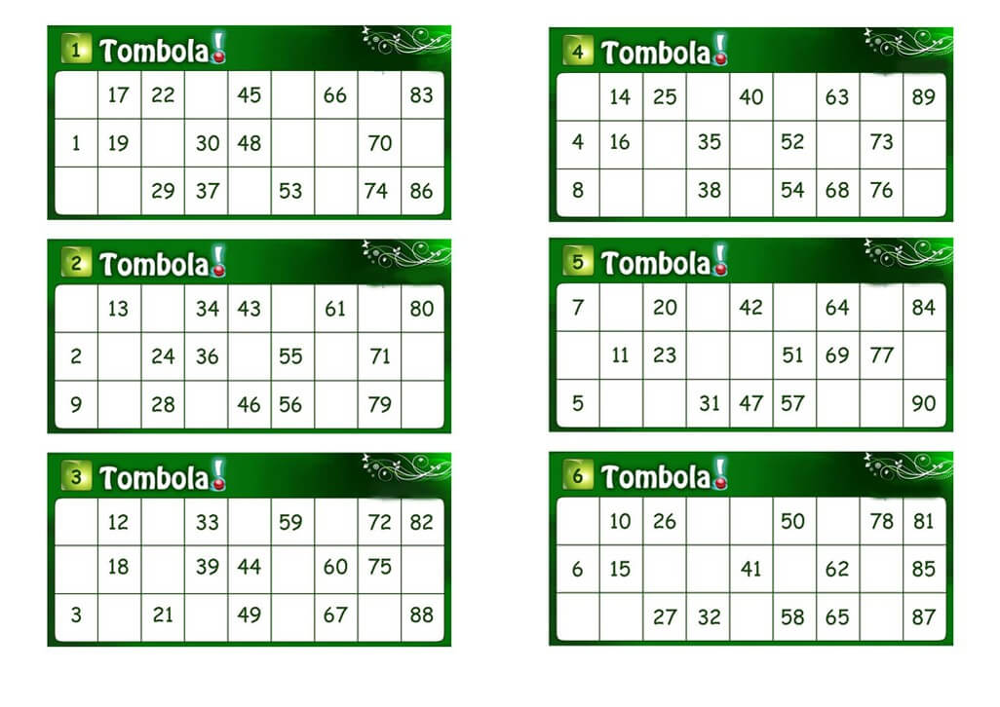

<h1>Tombola - validation <sup><sup>6 Kyu</sup></sup></h1>

<sup>
  <a href="https://www.codewars.com/kata/5898a751b2edc082f60005f4">
    <strong>LINK TO THE KATA</strong>
  </a> - <code>ARRAYS</code> <code>FUNDAMENTALS</code>
</sup>

## Description

**SHORT INTRO**

"Tombola" is an Italian raffle/bingo-like game, mostly played during Christmas holidays; you have a sheet with 15 numbers and win increasing prizes while you complete it. [Wikipedia link](<https://en.wikipedia.org/wiki/Tombola_(game)>).

**SHEET SAMPLES**



**THE KATA**

In this kata you have to validate the correctness of a tombola sheet. More specifically:

- check if the sheet is made of 3 x 9 squares;
- check if there is a total of 15 unique numbers (> 0) over the squares (empty spaces will be represented with zeros);
- check if each of the 3 rows has 5 of the 15 numbers;
- check if each column has from 1 to 3 numbers in increasing order from top to bottom row;
- check if each column is divided in this way (inclusive, from first column to last): 1-9, 10-19, 20-29, 30-39, 40-49, 50-59, 60-69, 70-79, 80-90 (<- careful here! 90 is included in the last range!).

## Solution

```javascript
const rows = 3
const columns = 9
const amountNumbersPerRow = 5

const removeZeros = array => array.filter(number => number !== 0)

const hasIncorrectNumberOfRows = (array, allowedRows) => {
  return array.length !== allowedRows
}

const hasIncorrectNumberOfColumns = (array, allowedColumns) => {
  return array.filter(row => row.length !== allowedColumns).length !== 0
}

const rowHasIncorrectAmountOfNumbers = (array, allowedAmount) => {
  return (
    array.filter(row => removeZeros(row).length !== allowedAmount).length !== 0
  )
}

const isEmptyColumn = array => removeZeros(array).length === 0

const numberIsNotOnRange = (number, startRange, endRange) => {
  return startRange > number || endRange < number
}

const previousNumberIsEqualOrGreaterThanCurrent = (
  previousNumber,
  currentNumber,
) => {
  return previousNumber >= currentNumber
}

const check_tombola = array => {
  if (
    hasIncorrectNumberOfRows(array, rows) ||
    hasIncorrectNumberOfColumns(array, columns) ||
    rowHasIncorrectAmountOfNumbers(array, amountNumbersPerRow)
  ) {
    return false
  }

  for (let i = 0; i < columns; i++) {
    const column = array.map(row => row[i])

    if (isEmptyColumn(column)) return false

    const columnWithoutZeros = removeZeros(column)
    const startRange = i === 0 ? 1 : i * 10
    const endRange = i === columns - 1 ? i * 10 + 10 : i * 10 + 9

    for (let i = 0; i < columnWithoutZeros.length; i++) {
      const number = columnWithoutZeros[i]
      const previousNumber = i > 0 ? columnWithoutZeros[i - 1] : 0

      if (
        numberIsNotOnRange(number, startRange, endRange) ||
        previousNumberIsEqualOrGreaterThanCurrent(previousNumber, number)
      ) {
        return false
      }
    }
  }

  return true
}
```
