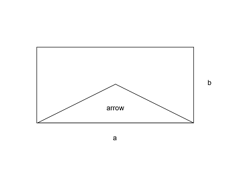

<h1>Area of an arrow <sup><sup>7 Kyu</sup></sup></h1>

<sup>
  <a href="https://www.codewars.com/kata/589478160c0f8a40870000bc">
    <strong>LINK TO THE KATA</strong>
  </a> - <code>MATHEMATICS</code>
</sup>

## Description

An arrow is formed in a rectangle with sides `a` and `b` by joining the bottom corners to the midpoint of the top edge and the centre of the rectangle.




`a` and `b` are `integers` and `> 0`

Write a function which returns the area of the arrow.

## Solution

```javascript
const arrowArea = (a, b) => (a * (b / 2)) / 2
```
